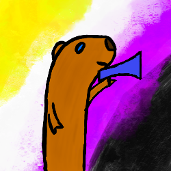

# FediSqueak

A fediverse client made primarily for use with GoToSocial instances.  
Build in React Native for iOS and Android.  
Very much work in progress.

## Current state of the project

As it stands right now, this app cannot do most things it will have to do before becoming a client anyone would want to actually use.  
Check out the [MVP project board](https://github.com/users/DysphoricUnicorn/projects/1/views/1) to see what it still lacks.

As it stands currently, even installing the project is a bit annoying since we've got some peer dependency mismatches that make it
impossible to just run `npm install`, you will need to add `--force`, which should really be fixed...

## Reasoning

Most clients available for mobile devices are made primarily for use with Mastodon. This leads to annoying bugs when encountering the things
that GoToSocial does differently than Mastodon.  
I also want a couple of features in my client that others don't care enough about to implement.

Once the project is production ready, I also want to include features that only some fedi backends have and
hide them behind feature gates.  
This could potentially make this the first intentional multi backend app for the fediverse.

## Naming

Why FediSqueak?  
Because my previous favourite fediverse client [Toot!](https://apps.apple.com/de/app/toot/id1229021451) is named after the sound a Mastodon
would make, which makes sense considering it is primarily intended for use with Mastodon.  
Since everything written in Go must have a Gopher as its mascot, I thought I'd name my client after the sound those make.  
The fact that GoToSocial breaks with the norm and has a sloth as its mascot did not impact this application's naming.
